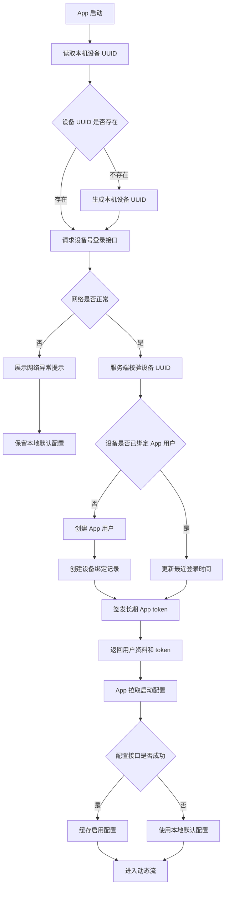
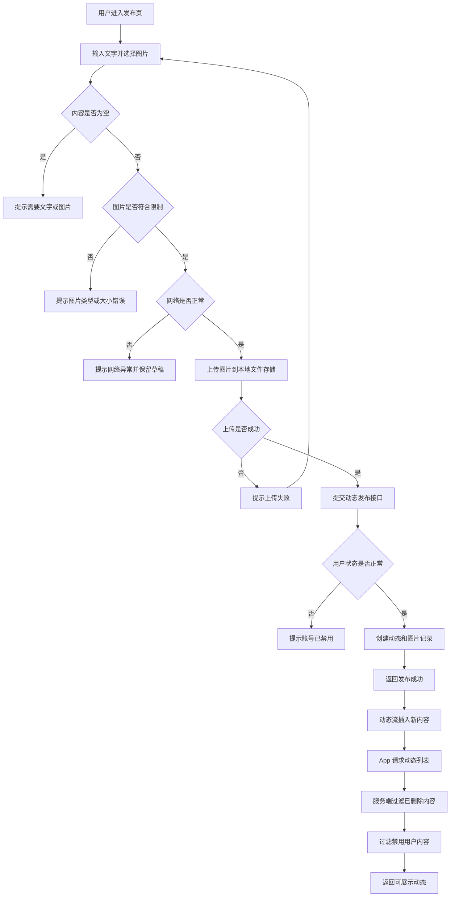
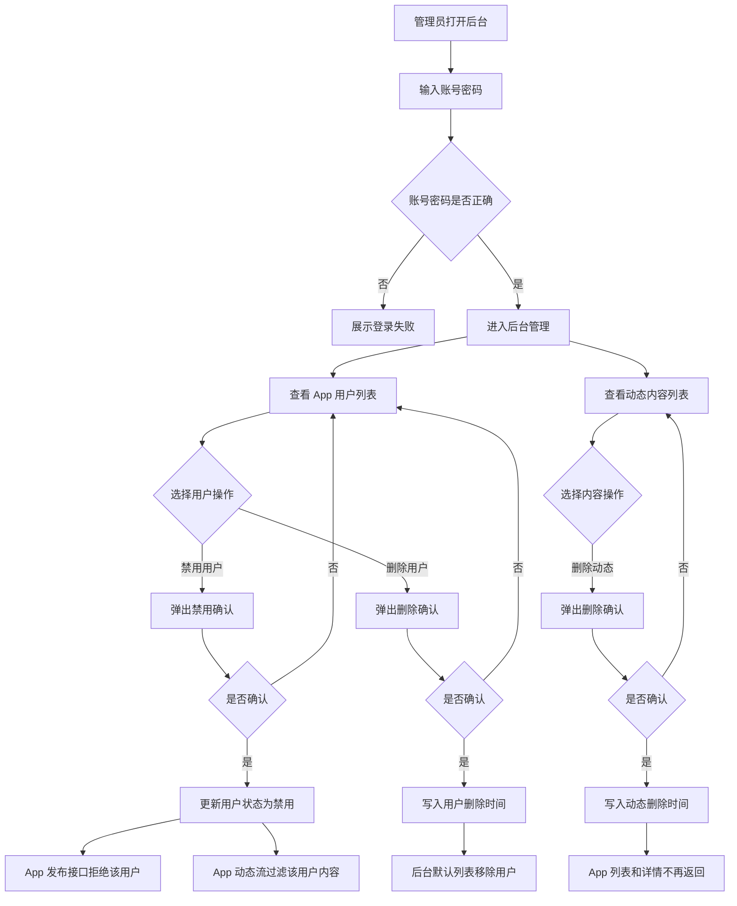
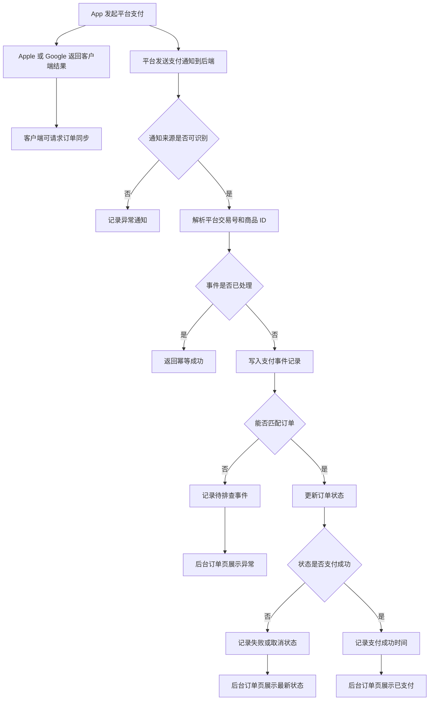
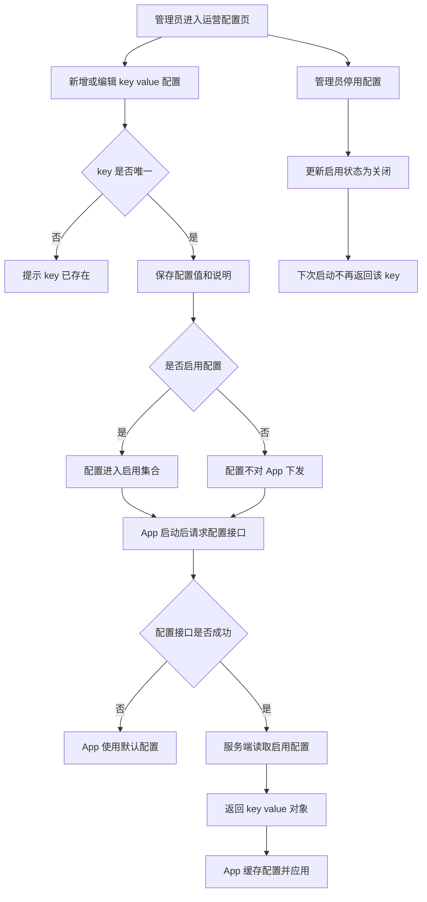

# App 服务端与后台管理系统流程图 v1.0

## 1. App 设备号登录与配置拉取

```mermaid
flowchart TD
  A["App 启动"] --> B["读取本机设备 UUID"]
  B --> C{"设备 UUID 是否存在"}
  C -- "不存在" --> C1["生成本机设备 UUID"]
  C -- "存在" --> D["请求设备号登录接口"]
  C1 --> D
  D --> E{"网络是否正常"}
  E -- "否" --> E1["展示网络异常提示"]
  E1 --> E2["保留本地默认配置"]
  E -- "是" --> F["服务端校验设备 UUID"]
  F --> G{"设备是否已绑定 App 用户"}
  G -- "否" --> H["创建 App 用户"]
  H --> I["创建设备绑定记录"]
  G -- "是" --> J["更新最近登录时间"]
  I --> K["签发长期 App token"]
  J --> K
  K --> L["返回用户资料和 token"]
  L --> M["App 拉取启动配置"]
  M --> N{"配置接口是否成功"}
  N -- "否" --> N1["使用本地默认配置"]
  N -- "是" --> O["缓存启用配置"]
  O --> P["进入动态流"]
  N1 --> P
```

## 2. 动态发布与动态流展示

```mermaid
flowchart TD
  A["用户进入发布页"] --> B["输入文字并选择图片"]
  B --> C{"内容是否为空"}
  C -- "是" --> C1["提示需要文字或图片"]
  C -- "否" --> D{"图片是否符合限制"}
  D -- "否" --> D1["提示图片类型或大小错误"]
  D -- "是" --> E{"网络是否正常"}
  E -- "否" --> E1["提示网络异常并保留草稿"]
  E -- "是" --> F["上传图片到本地文件存储"]
  F --> G{"上传是否成功"}
  G -- "否" --> G1["提示上传失败"]
  G1 --> B
  G -- "是" --> H["提交动态发布接口"]
  H --> I{"用户状态是否正常"}
  I -- "否" --> I1["提示账号已禁用"]
  I -- "是" --> J["创建动态和图片记录"]
  J --> K["返回发布成功"]
  K --> L["动态流插入新内容"]
  L --> M["App 请求动态列表"]
  M --> N["服务端过滤已删除内容"]
  N --> O["过滤禁用用户内容"]
  O --> P["返回可展示动态"]
```

## 3. 后台用户与内容治理

```mermaid
flowchart TD
  A["管理员打开后台"] --> B["输入账号密码"]
  B --> C{"账号密码是否正确"}
  C -- "否" --> C1["展示登录失败"]
  C -- "是" --> D["进入后台管理"]
  D --> E["查看 App 用户列表"]
  D --> F["查看动态内容列表"]
  E --> G{"选择用户操作"}
  G -- "禁用用户" --> H["弹出禁用确认"]
  H --> I{"是否确认"}
  I -- "否" --> E
  I -- "是" --> J["更新用户状态为禁用"]
  J --> K["App 发布接口拒绝该用户"]
  J --> L["App 动态流过滤该用户内容"]
  G -- "删除用户" --> M["弹出删除确认"]
  M --> N{"是否确认"}
  N -- "否" --> E
  N -- "是" --> O["写入用户删除时间"]
  O --> P["后台默认列表移除用户"]
  F --> Q{"选择内容操作"}
  Q -- "删除动态" --> R["弹出删除确认"]
  R --> S{"是否确认"}
  S -- "否" --> F
  S -- "是" --> T["写入动态删除时间"]
  T --> U["App 列表和详情不再返回"]
```

## 4. Apple IAP 与 Google Play 支付回调

```mermaid
flowchart TD
  A["App 发起平台支付"] --> B["Apple 或 Google 返回客户端结果"]
  B --> C["客户端可请求订单同步"]
  A --> D["平台发送支付通知到后端"]
  D --> E{"通知来源是否可识别"}
  E -- "否" --> E1["记录异常通知"]
  E -- "是" --> F["解析平台交易号和商品 ID"]
  F --> G{"事件是否已处理"}
  G -- "是" --> G1["返回幂等成功"]
  G -- "否" --> H["写入支付事件记录"]
  H --> I{"能否匹配订单"}
  I -- "否" --> I1["记录待排查事件"]
  I1 --> I2["后台订单页展示异常"]
  I -- "是" --> J["更新订单状态"]
  J --> K{"状态是否支付成功"}
  K -- "否" --> K1["记录失败或取消状态"]
  K -- "是" --> L["记录支付成功时间"]
  L --> M["后台订单页展示已支付"]
  K1 --> N["后台订单页展示最新状态"]
```

## 5. key-value 运营配置下发

```mermaid
flowchart TD
  A["管理员进入运营配置页"] --> B["新增或编辑 key value 配置"]
  B --> C{"key 是否唯一"}
  C -- "否" --> C1["提示 key 已存在"]
  C -- "是" --> D["保存配置值和说明"]
  D --> E{"是否启用配置"}
  E -- "否" --> F["配置不对 App 下发"]
  E -- "是" --> G["配置进入启用集合"]
  G --> H["App 启动后请求配置接口"]
  F --> H
  H --> I{"配置接口是否成功"}
  I -- "否" --> I1["App 使用默认配置"]
  I -- "是" --> J["服务端读取启用配置"]
  J --> K["返回 key value 对象"]
  K --> L["App 缓存配置并应用"]
  A --> M["管理员停用配置"]
  M --> N["更新启用状态为关闭"]
  N --> O["下次启动不再返回该 key"]
```
