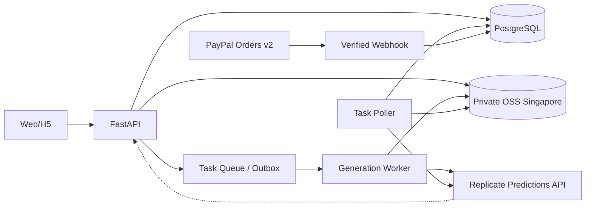

# Vireal Web/H5 技术方案 v1.0

更新时间：2026-09-10  
状态：开发基线（尚未进行真实付费模型调用）

## 1. 技术结论

当前需求改为通过 Replicate 异步 Predictions API 落地，模型路由如下：

| 场景 | 输入 | 模型 | 时长 | 音频 | 首期状态 |
|---|---|---|---|---|---|
| 拥抱 | 2 张独立单人全身照 | `wan-video/wan-2.7-r2v`（5/10 秒）或 `bytedance/seedance-2.0`（含 15 秒候选） | 5/10/15 秒 | 模型生成环境声 | 全部需 PoC；15 秒默认关闭 |
| 牵手 | 2 张独立单人全身照 | 同上 | 5/10/15 秒 | 模型生成环境声 | 全部需 PoC；15 秒默认关闭 |
| 亲吻 | 2 张独立单人全身照 | 同上 | 5/10/15 秒 | 模型生成环境声 | 功能开关默认关闭 |
| 跳舞 | 1 张单人全身照 + 固定动作视频 | `wan-video/wan-2.2-animate-animation` | 由 5/10/15 秒动作视频决定 | 合并动作视频音轨 | 开放，需 PoC 验收 |
| 俯卧撑 | 1 张单人全身照 + 固定动作视频 | `wan-video/wan-2.2-animate-animation` | 由 5/10/15 秒动作视频决定 | 合并动作视频音轨 | 开放，需 PoC 验收 |

Replicate 上的 Wan 2.7 R2V 明确限制为 2–10 秒，并提示多张参考素材更适合描述同一主体；本产品要求两张不同人物照片，因此 5/10 秒也必须验证人物不合并、不串脸。Seedance 2.0 支持最多 9 张参考图和最长 15 秒，可用 `[Image1]`、`[Image2]` 指定人物，是双人 15 秒候选，但未通过真实素材 PoC 前不得开放。模板变体必须保存实际模型名，Worker 按“模板 × 时长”路由，不由前端指定模型。

官方依据：

- [Replicate Wan 2.7 R2V](https://replicate.com/wan-video/wan-2.7-r2v)
- [Replicate Wan 2.2 Animate](https://replicate.com/wan-video/wan-2.2-animate-animation)
- [Replicate Seedance 2.0](https://replicate.com/bytedance/seedance-2.0)
- [Replicate Predictions](https://replicate.com/docs/topics/predictions)
- [Replicate data retention](https://replicate.com/docs/topics/predictions/data-retention)

## 2. 总体架构

部署建议：H5、API、Worker、PostgreSQL、Redis/队列和私有 OSS 继续选择新加坡。更换供应商后不得继续宣称推理发生在阿里云新加坡；隐私声明、同意文本和供应商清单应明确素材会发送给 Replicate 及其实际模型提供方处理，并以正式条款审核结果为准。

## 3. 外部接口封装

### 3.1 双人 R2V

- 创建：`POST https://api.replicate.com/v1/models/{owner}/{model}/predictions`。
- 查询：`GET https://api.replicate.com/v1/predictions/{prediction_id}`；取消使用对应 `/cancel` 端点。
- 必需请求头：`Authorization: Bearer ...`、`Content-Type: application/json`；默认异步，不发送 `Prefer: wait`。
- Wan 输入使用 `reference_images`、`prompt`、`duration`、`resolution=720p`、`aspect_ratio=9:16`；提示词按模型实测固化人物引用方式。
- Seedance 输入使用同名参考图数组，提示词必须用 `[Image1]`、`[Image2]` 对应人物顺序，并固定 `generate_audio=true`。
- 单张人物参考图只能包含一个人物；格式、尺寸和大小在上传阶段按模型限制预校验。

### 3.2 单人动作迁移

- 创建：`POST https://api.replicate.com/v1/models/wan-video/wan-2.2-animate-animation/predictions`。
- `character_image` 是用户全身照，`video` 是平台预置并已获音乐/动作授权的模板视频。
- 首期固定 `resolution=720`、`frames_per_second=24`、`go_fast=true`、`refert_num=1`。
- `merge_audio=true` 时保留模板视频音轨；没有授权音轨时必须关闭。不得在生成后临时拼接未经授权的音乐。

### 3.3 异步任务

Replicate API 创建后返回 prediction ID；状态归一化为：

`starting/processing → PENDING/RUNNING → SUCCEEDED | FAILED | CANCELED | UNKNOWN`

创建时仅订阅 `completed` Webhook，验签并幂等处理；Poller 作为丢回调和乱序回调的兜底。Replicate API 预测的输入、输出和日志默认约 1 小时后删除，成功后必须立即下载 `output` URI 并写入私有 OSS；客户端永远不直接依赖 `replicate.delivery` URL，也不接触 API Token。

## 4. 业务 API 草案

| 方法 | 路径 | 用途 | 关键约束 |
|---|---|---|---|
| `GET` | `/api/v1/app/video-templates` | 获取模板、支持时长和金币 | 由服务端配置决定，不信任前端价格 |
| `POST` | `/api/v1/app/uploads/presign` | 获取私有 OSS 上传凭证 | 限图片类型、大小、用户目录和短时效 |
| `POST` | `/api/v1/app/generations` | 创建生成任务 | `Idempotency-Key` 必填；原子扣币 |
| `GET` | `/api/v1/app/generations/{id}` | 查询自己的任务 | 只能读取本人数据 |
| `GET` | `/api/v1/app/works` | 作品记录 | 仅本人；含处理中和失败任务 |
| `GET` | `/api/v1/app/works/{id}/play-url` | 获取短期播放地址 | OSS 签名 URL，不返回对象内部路径 |
| `GET` | `/api/v1/app/works/{id}/download-url` | 获取短期下载地址 | `Content-Disposition: attachment` |
| `DELETE` | `/api/v1/app/works/{id}` | 删除作品 | 立即不可访问，最迟 24 小时物理清除 |
| `GET` | `/api/v1/app/wallet` | 余额与最近流水 | 余额来自账本汇总或锁定行 |
| `POST` | `/api/v1/app/paypal/orders` | 创建 PayPal 金币订单 | 服务端写死商品和美元金额 |
| `POST` | `/api/v1/app/paypal/orders/{id}/capture` | 用户批准后捕获 | 捕获完成仍需幂等入账 |
| `POST` | `/api/v1/webhooks/paypal` | PayPal 事件 | 必须验证签名、事件 ID 去重 |

## 5. 数据模型增量

在现有 `AppUser`、`AppOrder` 基础上新增：

| 表 | 关键字段 | 唯一性/索引 |
|---|---|---|
| `app_auth_identity` | `app_user_id, provider, provider_subject, email` | `(provider, provider_subject)` 唯一 |
| `video_template` | `slug, subject_count, model, prompt_version, enabled` | `slug` 唯一 |
| `video_template_variant` | `template_id, duration, coin_cost, action_asset_key` | `(template_id, duration)` 唯一 |
| `wallet` | `app_user_id, balance, version` | `app_user_id` 唯一；乐观锁或行锁 |
| `coin_ledger` | `app_user_id, amount, type, business_key` | `business_key` 唯一 |
| `generation_task` | `template_id, duration, status, provider_task_id, debit_ledger_id, refund_ledger_id` | `(app_user_id, idempotency_key)` 唯一；`provider_task_id` 唯一 |
| `generation_asset` | `task_id, kind, oss_key, status, purge_after, purged_at` | `purge_after` 索引 |
| `consent_event` | `app_user_id, task_id, policy_version, accepted_at, ip_country` | `task_id` 索引 |
| `paypal_webhook_event` | `event_id, event_type, payload_hash, processed_at` | `event_id` 唯一 |
| `complaint_case` | `reporter, work_id, reason, status, audit_snapshot` | `work_id, status` 索引 |

不保存身份证或活体认证材料。用于追溯的同意记录、任务元数据、输入/输出哈希和投诉处理记录保留 180 天；媒体本体最多 24 小时。

## 6. 生成事务与幂等

1. 服务端验证登录、地区、模板开关、时长、图片数量、声明版本和 OSS 对象归属。
2. 在同一数据库事务中锁定钱包，写入任务、扣币账本和 Outbox 事件；`business_key=generation:{id}:debit`。
3. Worker 领取任务后只提交一次 Replicate Prediction，保存 `provider_task_id`（即 prediction ID）和实际模型名。
4. Poller 只查询已有任务 ID，绝不通过“再创建一次”来重试。
5. 终态失败时写返币账本，`business_key=generation:{id}:refund`；唯一键保证最多返还一次。
6. 成功但结果下载/OSS 转存失败也视为用户不可交付，返还金币；同时保留内部告警和补偿转存任务。

创建 Prediction 不作为业务幂等边界。若请求已被服务商接收、但本地在保存 prediction ID 前崩溃，不能盲目重提；任务进入 `SUBMIT_UNKNOWN`，通过供应商控制台和内部关联字段排查，超时后向用户返币。这能避免同一用户意图产生两笔付费模型任务。

## 7. 媒体安全与生命周期

- 原图和结果使用私有 OSS Bucket，禁止匿名列举和公开读。
- 给 Replicate 的输入签名 URL 建议 30 分钟有效；给用户播放/下载的签名 URL 建议 5 分钟有效。
- OSS Key 使用随机 UUID，不包含邮箱、昵称或原文件名。
- 上传完成后服务端重新探测 MIME、像素尺寸、文件大小，不能只信浏览器声明。
- 用户删除：数据库立即置 `deleted_at`，所有新签名请求返回 404；异步清理对象，最迟 24 小时完成。
- 自动过期：上传和生成时间起算 24 小时；清理任务可重复执行，`purged_at` 保证幂等。
- 日志禁止记录签名 URL、API Key、OAuth token、原图内容和 PayPal access token。

## 8. 登录、地区与支付

登录使用 Apple ID、Google 和邮箱验证码。移动端默认顺序仅由 User-Agent/平台能力决定，所有方式均可手动选择。OAuth 回调必须校验 `state`、PKCE、issuer、audience、nonce 和已验证邮箱。

中国大陆限制采用多层判断：CDN/边缘 IP 国家、后端 IP 国家、账户国家、PayPal 可用国家和明确用户声明。命中 `CN` 时禁止注册、登录后的生成和购买，展示“当前地区暂未开放服务”。IP 判断不是身份认证，不能承诺绝对阻断 VPN；需要配合服务条款和风控审计。

PayPal 使用服务端 Orders v2：创建订单 → 用户批准 → 服务端捕获。金币只能在捕获状态确认、金额/币种/商品匹配且未处理过时入账。Webhook 必须回传 PayPal 验证签名或进行等价本地验证，并以 PayPal event ID 去重。

官方依据：[PayPal Orders v2](https://developer.paypal.com/api/rest/integration/orders-api)、[PayPal Webhook verification](https://developer.paypal.com/api/rest/webhooks/rest/)。

## 9. 监控与告警

- 指标：提交成功率、终态成功率、各模板/时长 P50/P95 耗时、审核拒绝率、返币率、转存失败率、每成功视频模型成本。
- 告警：`SUBMIT_UNKNOWN`、Poller 24 小时未终态、余额不守恒、同一业务键冲突、OSS 清理超过 24 小时、PayPal 捕获后未入账。
- 追踪：本地 `generation_id`、Replicate `prediction_id/model`、Webhook `webhook-id`、PayPal `order_id/capture_id/event_id` 分开存储并可关联查询。

## 10. 当前代码状态

现有 FastAPI 项目已新增 `app/services/video_generation.py` 和 `app/services/replicate_video.py`，实现：

- 供应商无关的任务状态、提交和结果接口；
- Wan 2.7 R2V、Seedance 2.0 候选路由和 Wan 2.2 Animate 创建；
- Replicate Prediction 查询、取消、状态和结果 URI 归一化；
- Wan 最长 10 秒、Seedance 最长 15 秒等模型级参数校验；
- 可选 completed Webhook 配置和 API 错误上下文保留；
- 默认关闭开关，未配置凭证时不会产生付费调用。

尚未实现数据库任务编排、Webhook 接收与验签、OSS、PayPal 和前台页面，这些按实施 Backlog 进入后续迭代。
