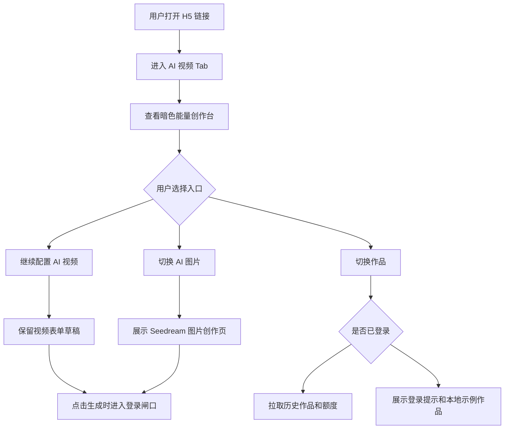
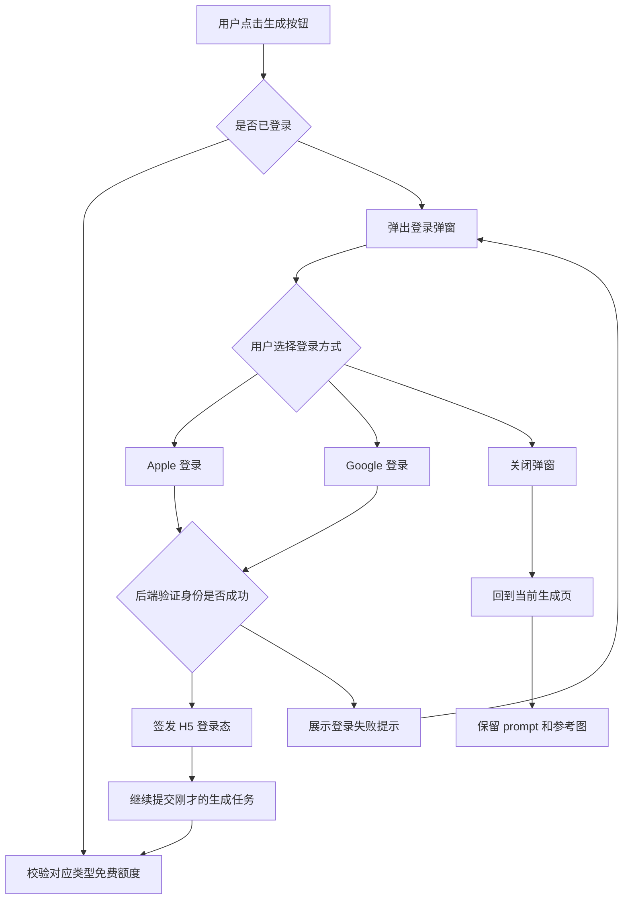
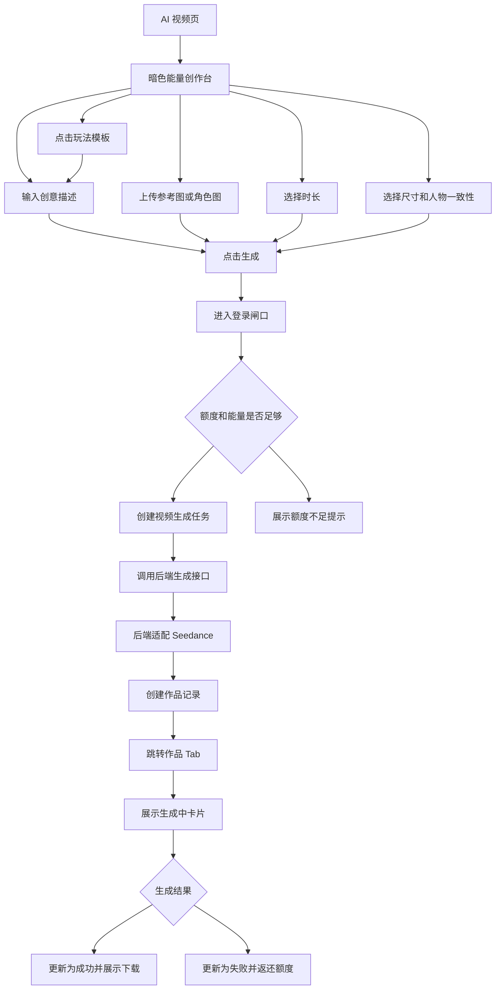
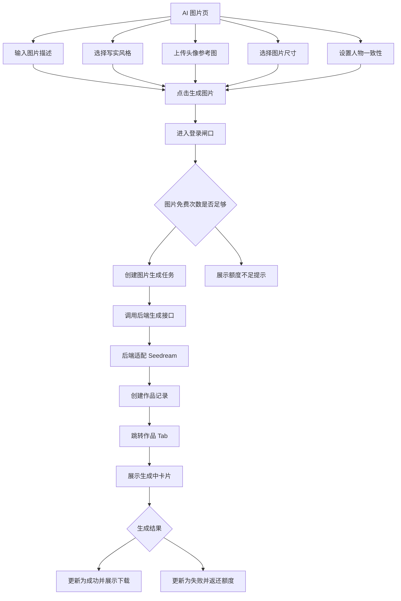
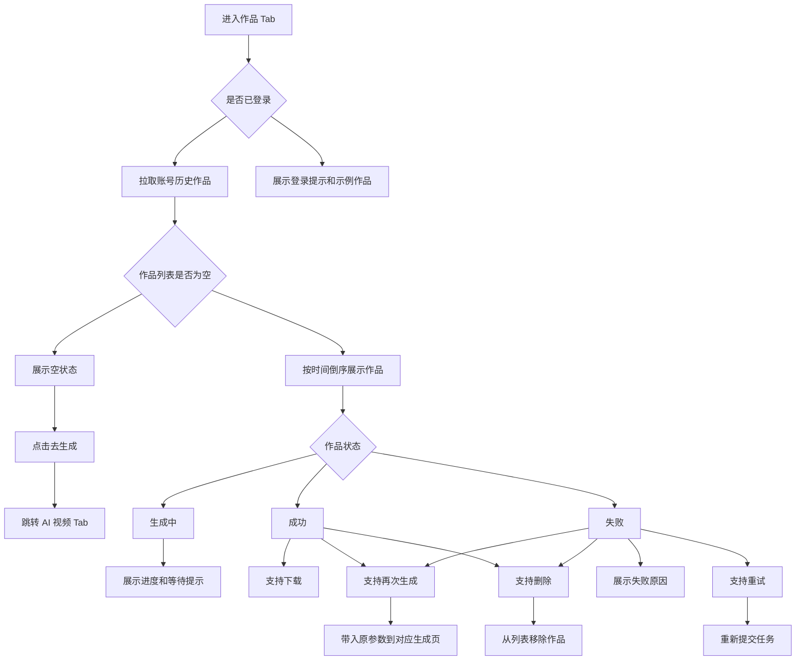
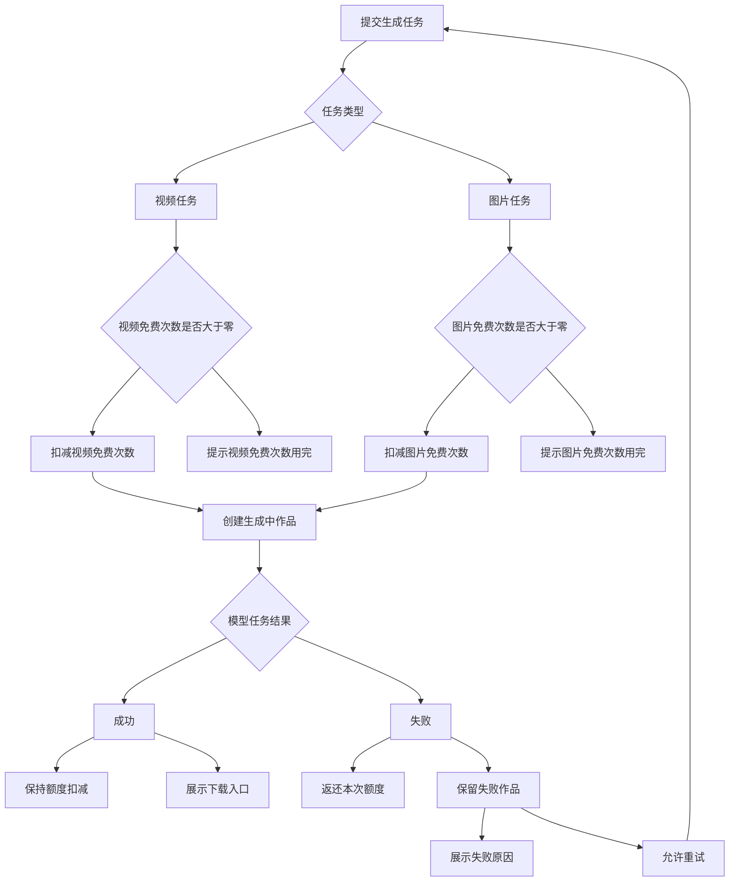

# Vireal H5 AI 创作端流程图 v1.0

## 1. H5 入口与 Tab 流转

```mermaid
flowchart TD
  A["用户打开 H5 链接"] --> B["进入 AI 视频 Tab"]
  B --> C["查看暗色能量创作台"]
  C --> D{"用户选择入口"}
  D --> E["继续配置 AI 视频"]
  D --> F["切换 AI 图片"]
  D --> G["切换作品"]
  E --> H["保留视频表单草稿"]
  F --> I["展示 Seedream 图片创作页"]
  G --> J{"是否已登录"}
  J --> K["拉取历史作品和额度"]
  J --> L["展示登录提示和本地示例作品"]
  H --> M["点击生成时进入登录闸口"]
  I --> M
```

## 2. Apple 和 Google 登录闸口

```mermaid
flowchart TD
  A["用户点击生成按钮"] --> B{"是否已登录"}
  B --> C["校验对应类型免费额度"]
  B --> D["弹出登录弹窗"]
  D --> E{"用户选择登录方式"}
  E --> F["Apple 登录"]
  E --> G["Google 登录"]
  E --> H["关闭弹窗"]
  F --> I{"后端验证身份是否成功"}
  G --> I
  I --> J["签发 H5 登录态"]
  I --> K["展示登录失败提示"]
  K --> D
  H --> L["回到当前生成页"]
  L --> M["保留 prompt 和参考图"]
  J --> N["继续提交刚才的生成任务"]
  N --> C
```

## 3. Seedance 视频生成

```mermaid
flowchart TD
  A["AI 视频页"] --> B["暗色能量创作台"]
  B --> C["输入创意描述"]
  B --> D["上传参考图或角色图"]
  B --> E["选择时长"]
  B --> F["选择尺寸和人物一致性"]
  B --> G["点击玩法模板"]
  G --> C
  C --> H["点击生成"]
  D --> H
  E --> H
  F --> H
  H --> I["进入登录闸口"]
  I --> J{"额度和能量是否足够"}
  J --> K["创建视频生成任务"]
  J --> L["展示额度不足提示"]
  K --> M["调用后端生成接口"]
  M --> N["后端适配 Seedance"]
  N --> O["创建作品记录"]
  O --> P["跳转作品 Tab"]
  P --> Q["展示生成中卡片"]
  Q --> R{"生成结果"}
  R --> S["更新为成功并展示下载"]
  R --> T["更新为失败并返还额度"]
```

## 4. Seedream 图片生成

```mermaid
flowchart TD
  A["AI 图片页"] --> B["输入图片描述"]
  A --> C["选择写实风格"]
  A --> D["上传头像参考图"]
  A --> E["选择图片尺寸"]
  A --> F["设置人物一致性"]
  B --> G["点击生成图片"]
  C --> G
  D --> G
  E --> G
  F --> G
  G --> H["进入登录闸口"]
  H --> I{"图片免费次数是否足够"}
  I --> J["创建图片生成任务"]
  I --> K["展示额度不足提示"]
  J --> L["调用后端生成接口"]
  L --> M["后端适配 Seedream"]
  M --> N["创建作品记录"]
  N --> O["跳转作品 Tab"]
  O --> P["展示生成中卡片"]
  P --> Q{"生成结果"}
  Q --> R["更新为成功并展示下载"]
  Q --> S["更新为失败并返还额度"]
```

## 5. 作品管理

```mermaid
flowchart TD
  A["进入作品 Tab"] --> B{"是否已登录"}
  B --> C["拉取账号历史作品"]
  B --> D["展示登录提示和示例作品"]
  C --> E{"作品列表是否为空"}
  E --> F["展示空状态"]
  E --> G["按时间倒序展示作品"]
  F --> H["点击去生成"]
  H --> I["跳转 AI 视频 Tab"]
  G --> J{"作品状态"}
  J --> K["生成中"]
  J --> L["成功"]
  J --> M["失败"]
  K --> N["展示进度和等待提示"]
  L --> O["支持下载"]
  L --> P["支持再次生成"]
  L --> Q["支持删除"]
  M --> R["展示失败原因"]
  M --> S["支持重试"]
  M --> P
  M --> Q
  P --> T["带入原参数到对应生成页"]
  S --> U["重新提交任务"]
  Q --> V["从列表移除作品"]
```

## 6. 额度和失败返还

```mermaid
flowchart TD
  A["提交生成任务"] --> B{"任务类型"}
  B --> C["视频任务"]
  B --> D["图片任务"]
  C --> E{"视频免费次数是否大于零"}
  D --> F{"图片免费次数是否大于零"}
  E --> G["扣减视频免费次数"]
  E --> H["提示视频免费次数用完"]
  F --> I["扣减图片免费次数"]
  F --> J["提示图片免费次数用完"]
  G --> K["创建生成中作品"]
  I --> K
  K --> L{"模型任务结果"}
  L --> M["成功"]
  L --> N["失败"]
  M --> O["保持额度扣减"]
  M --> P["展示下载入口"]
  N --> Q["返还本次额度"]
  N --> R["保留失败作品"]
  R --> S["展示失败原因"]
  R --> T["允许重试"]
  T --> A
```
